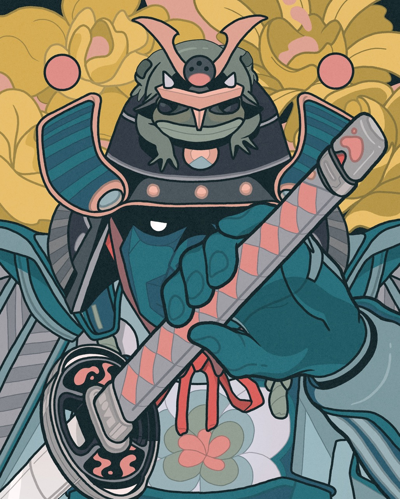

[samurai-frog.html](https://github.com/user-attachments/files/26449072/samurai-frog.html)
<!DOCTYPE html>
<html lang="en">
<head>
<meta charset="UTF-8">
<meta name="viewport" content="width=device-width, initial-scale=1.0">
<title>Samurai Frog — Unsheathe</title>

</head>
<body>

  <!-- Title -->
  

    武士蛙
    

    

      SAMURAI FROG 
      WARRIOR CLASS · NFT
    

  

  <!-- Card Frame -->
  

    

    

    

    

    

    

      

      <!-- Sword overlay -->
      

        

        

          

          

        

        

        

      

    

  

  <!-- UI -->
  

    

      KATANA · #4471
      SHEATHED
    

    

      

        ATK
        

          

        

      

      

        SPD
        

          

        

      

      

        HONOR
        

          

        

      

    

    

    <button class="draw-btn" id="drawBtn" onclick="drawSword()">⚔ DRAW SWORD</button>
    <button class="sheathe-btn" id="sheatheBtn" onclick="sheatheSword()">↩ SHEATHE</button>
  

</body>
</html>
